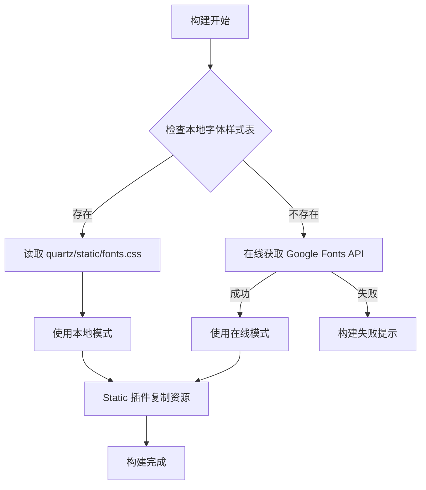

# 静态资源本地化配置指南

本文档记录了 Quartz 项目中静态资源（Google Fonts、KaTeX 等）的完整本地化过程，实现了**断网环境下的离线构建能力**。

> 本文档由AI生成。

## 📋 目录

- [背景与目标](#背景与目标)
- [本地化资源清单](#本地化资源清单)
- [技术实现方案](#技术实现方案)
- [文件修改记录](#文件修改记录)
- [使用说明](#使用说明)
- [故障排查](#故障排查)

---

## 背景与目标

### 问题描述
原项目依赖外部 CDN 资源：
- Google Fonts API（字体样式表和字体文件）
- KaTeX CDN（数学公式渲染库）
- Mermaid CDN（流程图库）

在**断网环境**下构建时会报错：
```
ERROR: Failed to emit from plugin `ComponentResources`: fetch failed
```

### 解决目标
✅ 实现完全离线构建能力  
✅ 保持在线环境的自动下载功能  
✅ 提供资源下载脚本便于初始化  

---

## 本地化资源清单

### ✅ 已完全本地化

#### 1. Google Fonts（10个字体文件）

| 字体系列 | 字重 | 样式 | 文件数 |
|---------|------|------|--------|
| IBM Plex Mono | 400, 600 | normal | 2 |
| Schibsted Grotesk | 400, 700 | normal, italic | 4 |
| Source Sans Pro | 400, 600 | normal, italic | 4 |

**存储位置：**
- 源文件：`quartz/static/fonts/*.ttf`（10个文件）
- 样式表：`quartz/static/fonts.css`
- 构建输出：`public/static/fonts/*.ttf`（自动复制）

#### 2. KaTeX 数学公式库（22个文件）

- `katex.min.css` - 样式文件
- `copy-tex.min.js` - 复制功能脚本
- 20个 woff2 字体文件

**存储位置：** `quartz/static/katex/`

### ⚠️ 部分本地化

#### 3. Mermaid 流程图库

- 已下载到 `quartz/static/mermaid/`
- 但因 ESM 动态导入限制，**仍使用 CDN**
- 离线环境下流程图功能不可用

### ❌ 无法本地化

#### 4. Giscus 评论系统

- 需要连接 GitHub API 和 giscus.app 服务
- 必须在联网环境下使用

---

## 技术实现方案

### 核心思路



### 关键技术点

#### 1. 字体路径处理

**问题：** 原代码使用硬编码的 `https://` 协议
```typescript
// ❌ 原代码
const staticUrl = `https://${baseUrl}/static/fonts/${filename}.${extension}`
```

**解决：** 改用相对路径，兼容 HTTP/HTTPS
```typescript
// ✅ 修复后
const staticUrl = `/static/fonts/${filename}.${extension}`
```

**位置：** `quartz/util/theme.ts` 第 138 行

#### 2. 离线/在线自动切换

**实现逻辑：**
```typescript
// 1. 优先尝试本地加载
const localFontsCssPath = resolve("quartz/static/fonts.css")

if (existsSync(localFontsCssPath)) {
  // 离线模式：读取本地文件
  googleFontsStyleSheet = readFileSync(localFontsCssPath, "utf-8")
  console.log("使用本地字体样式表（离线模式）")
}

// 2. 回退到在线获取
if (!googleFontsStyleSheet) {
  console.log("本地字体样式表不可用，尝试在线获取...")
  const response = await fetch(googleFontHref(theme))
  googleFontsStyleSheet = await response.text()
  // ... 下载字体文件
}
```

**位置：** `quartz/plugins/emitters/componentResources.ts` 第 285-325 行

#### 3. 静态资源自动复制

Quartz 的 `Static` 插件会自动将 `quartz/static/` 目录下的所有内容复制到 `public/static/`，无需额外配置。

---

## 文件修改记录

### 1️⃣ 创建本地字体样式表

**文件：** `quartz/static/fonts.css`（新建）

```css
@font-face {
  font-family: 'IBM Plex Mono';
  font-style: normal;
  font-weight: 400;
  font-display: swap;
  src: url(/static/fonts/-F63fjptAgt5VM-kVkqdyU8n5ig.ttf) format('truetype');
}
/* ... 其他 9 个字体声明 */
```

**说明：**
- 包含 10 个 `@font-face` 规则
- 所有 URL 使用相对路径 `/static/fonts/xxx.ttf`
- 通过在线获取 Google Fonts API 生成，然后手动修改路径

**获取方式：**
```bash
curl "https://fonts.googleapis.com/css2?family=Schibsted+Grotesk:ital,wght@0,400;0,700;1,400;1,700&family=Source+Sans+Pro:ital,wght@0,400;0,600;1,400;1,600&family=IBM+Plex+Mono:wght@400;600&display=swap" > quartz/static/fonts.css
```

### 2️⃣ 修改字体路径生成逻辑

**文件：** `quartz/util/theme.ts`

**修改位置：** 第 137-139 行

```diff
  let match
  while ((match = fontSourceRegex.exec(stylesheet)) !== null) {
    const url = match[1]
    const filename = match[2]
    const extension = fontMimeMap[match[3].toLowerCase()]
-   const staticUrl = `https://${baseUrl}/static/fonts/${filename}.${extension}`
+   // 使用相对路径，让浏览器根据当前协议自动选择 http/https
+   const staticUrl = `/static/fonts/${filename}.${extension}`

    processedStylesheet = processedStylesheet.replace(url, staticUrl)
    fontFiles.push({ url, filename, extension })
  }
```

**影响：**
- 修复了开发环境下 HTTP/HTTPS 协议不匹配的问题
- 生成的 CSS 使用浏览器兼容的相对路径

### 3️⃣ 实现离线构建支持

**文件：** `quartz/plugins/emitters/componentResources.ts`

**修改位置：** 第 1-21 行（导入部分）

```diff
  import { Features, transform } from "lightningcss"
  import { transform as transpile } from "esbuild"
  import { write } from "./helpers"
+ import { readFileSync, existsSync } from "fs"
+ import { resolve } from "path"
```

**修改位置：** 第 280-340 行（字体加载逻辑）

```typescript
// 新增：优先读取本地字体样式表
const localFontsCssPath = resolve("quartz/static/fonts.css")

if (existsSync(localFontsCssPath)) {
  try {
    googleFontsStyleSheet = readFileSync(localFontsCssPath, "utf-8")
    console.log("使用本地字体样式表（离线模式）")
  } catch (readError) {
    console.log(`读取本地字体样式表失败: ${readError}, 将尝试在线获取...`)
  }
}

// 回退到在线模式（原有逻辑）
if (!googleFontsStyleSheet) {
  console.log("本地字体样式表不可用，尝试在线获取...")
  // ... 原有的 fetch 逻辑
}
```

**错误提示优化：**
```typescript
throw new Error(
  `无法加载 Google Fonts（离线环境）。请确保:\n` +
  `1. 字体样式表存在: quartz/static/fonts.css\n` +
  `2. 字体文件已下载到: quartz/static/ 目录（会自动复制到 public/static/fonts/）\n` +
  `3. 或者在联网环境下构建以自动下载字体\n` +
  `原始错误: ${fetchError instanceof Error ? fetchError.message : String(fetchError)}`
)
```

### 4️⃣ 更新资源下载脚本

**文件：** `scripts/download-external-resources.js`

**修改位置：** 第 10-102 行（resources 数组）

```diff
  const resources = [
+   // Google Fonts 字体文件（新增 10 个）
+   {
+     url: 'https://fonts.gstatic.com/s/ibmplexmono/v20/-F63fjptAgt5VM-kVkqdyU8n5ig.ttf',
+     dest: 'quartz/static/fonts/-F63fjptAgt5VM-kVkqdyU8n5ig.ttf'
+   },
+   // ... 其他 9 个字体
    // KaTeX 资源（保持不变）
    // Mermaid 资源（保持不变）
  ];
```

**统计：**
- Google Fonts: 10 个文件
- KaTeX: 22 个文件（CSS + JS + 20个字体）
- Mermaid: 1 个文件
- **总计：33 个文件**

### 5️⃣ 配置文件保持不变

**文件：** `quartz.config.ts`

```typescript
theme: {
  fontOrigin: "googleFonts",  // 触发字体加载逻辑
  cdnCaching: false,          // 禁用 CDN，使用本地资源
  typography: {
    header: "Schibsted Grotesk",
    body: "Source Sans Pro",
    code: "IBM Plex Mono",
  },
}
```

**说明：**
- `fontOrigin: "googleFonts"` 必须保持，用于触发字体处理逻辑
- `cdnCaching: false` 确保不使用 Google Fonts CDN
- 不要改为 `fontOrigin: "local"`，那样会完全跳过字体处理

---

## 使用说明

### 📦 首次配置（需要联网）

#### 步骤 1：下载所有资源

```bash
cd e:\ProgramProjects\VScode_projects\quartz
node scripts/download-external-resources.js
```

**预期输出：**
```
开始下载外部资源...

正在下载: https://fonts.gstatic.com/s/ibmplexmono/v20/-F63fjptAgt5VM-kVkqdyU8n5ig.ttf
✓ 已保存: quartz/static/fonts/-F63fjptAgt5VM-kVkqdyU8n5ig.ttf
... (共 33 个文件)

下载完成！成功: 33, 失败: 0

正在修改 KaTeX CSS 字体路径...
✓ KaTeX CSS 字体路径已更新
```

#### 步骤 2：验证资源完整性

```bash
# 检查字体样式表
ls quartz/static/fonts.css

# 检查字体文件（应该是 10 个）
ls quartz/static/fonts/*.ttf

# 检查 KaTeX 资源
ls quartz/static/katex/
```

### 🚀 离线构建（无需联网）

#### 标准构建

```bash
npx quartz build
```

**成功标志：**
```
使用本地字体样式表（离线模式）
Emitted 333 files to `public` in 405ms
Done processing 178 files in 1s
```

#### 构建 + 开发服务器

```bash
npx quartz build --serve
```

访问 `http://localhost:8080` 查看效果。

### 📊 构建模式对比

| 模式 | 日志输出 | 网络需求 | 文件数 |
|------|---------|---------|--------|
| **离线模式** | `使用本地字体样式表（离线模式）` | ❌ 无需网络 | 333 |
| **在线模式** | `本地字体样式表不可用，尝试在线获取...` | ✅ 需要网络 | 341 |
| **断网错误** | `ERROR: fetch failed` | ⚠️ 需要网络但不可用 | - |

**文件数差异说明：**
- 离线模式：使用预先准备的 `fonts.css`，字体文件由 Static 插件复制
- 在线模式：实时下载字体文件，会生成额外的临时文件

---

## 故障排查

### ❌ 问题 1：显示"在线获取"但应该离线

**症状：**
```
本地字体样式表不可用，尝试在线获取...
```

**排查步骤：**

1. 检查文件是否存在
   ```bash
   ls quartz/static/fonts.css
   ```

2. 检查文件权限
   ```bash
   # Windows PowerShell
   Get-Acl quartz/static/fonts.css
   ```

3. 检查文件内容是否完整
   ```bash
   # 应该包含 10 个 @font-face 规则
   grep -c "@font-face" quartz/static/fonts.css
   ```

**解决方案：**
重新下载资源
```bash
node scripts/download-external-resources.js
```

### ❌ 问题 2：字体加载 404 错误

**症状：**
浏览器控制台显示：
```
GET https://localhost:8181/static/fonts/xxx.ttf 404 (Not Found)
```

**原因分析：**
- 开发服务器使用 HTTP 协议（端口 8080）
- 但配置的 baseUrl 使用了 HTTPS 协议（端口 8181）

**解决方案：**
已通过修改 `theme.ts` 使用相对路径解决，无需修改配置。

### ❌ 问题 3：断网环境构建失败

**症状：**
```
ERROR: Failed to emit from plugin `ComponentResources`: fetch failed
```

**原因：**
本地资源未准备好

**解决方案：**

1. **在联网环境下**运行下载脚本
   ```bash
   node scripts/download-external-resources.js
   ```

2. 将以下文件复制到断网环境：
   ```
   quartz/static/fonts/        (10个 .ttf 文件)
   quartz/static/fonts.css     (字体样式表)
   quartz/static/katex/        (22个文件)
   ```

3. 在断网环境下构建
   ```bash
   npx quartz build
   ```

### ❌ 问题 4：字体文件数量不对

**预期：** `quartz/static/fonts/` 应该有 **10 个 .ttf 文件**

**检查命令：**
```bash
# Windows PowerShell
(Get-ChildItem quartz/static/fonts/*.ttf).Count

# 应该输出: 10
```

**字体清单：**
```
-F63fjptAgt5VM-kVkqdyU8n5ig.ttf                    (IBM Plex Mono 400)
-F6qfjptAgt5VM-kVkqdyU8n3vAO8lc.ttf                (IBM Plex Mono 600)
6xK1dSBYKcSV-LCoeQqfX1RYOo3qPa7g.ttf               (Source Sans Pro 400 italic)
6xK3dSBYKcSV-LCoeQqfX1RYOo3aPw.ttf                 (Source Sans Pro 400)
6xKwdSBYKcSV-LCoeQqfX1RYOo3qPZY4lBdr.ttf           (Source Sans Pro 600 italic)
6xKydSBYKcSV-LCoeQqfX1RYOo3i54rAkA.ttf             (Source Sans Pro 600)
JqzI5SSPQuCQF3t8uOwiUL-taUTtap9DcSQBg_nT9FQY6oIPC8hq.ttf  (Schibsted Grotesk 700 italic)
JqzI5SSPQuCQF3t8uOwiUL-taUTtap9DcSQBg_nT9FQY6oLoDMhq.ttf  (Schibsted Grotesk 400 italic)
JqzK5SSPQuCQF3t8uOwiUL-taUTtarVKQ9vZ6pJJWlMNIsEATw.ttf     (Schibsted Grotesk 400)
JqzK5SSPQuCQF3t8uOwiUL-taUTtarVKQ9vZ6pJJWlMNxcYATw.ttf     (Schibsted Grotesk 700)
```

**修复：**
重新运行下载脚本，确保所有文件下载完整。

---

## 📚 相关文件清单

### 核心配置文件
- `quartz.config.ts` - 主配置文件
- `quartz/static/fonts.css` - 本地字体样式表

### 修改的源代码
- `quartz/util/theme.ts` - 字体路径处理
- `quartz/plugins/emitters/componentResources.ts` - 离线构建逻辑

### 工具脚本
- `scripts/download-external-resources.js` - 资源下载脚本

### 静态资源目录
```
quartz/static/
├── fonts/                # Google Fonts (10个文件)
│   ├── *.ttf
├── fonts.css             # 字体样式表
├── katex/                # KaTeX 资源 (22个文件)
│   ├── katex.min.css
│   ├── copy-tex.min.js
│   └── fonts/*.woff2
└── mermaid/              # Mermaid 资源
    └── mermaid.esm.min.mjs
```

---

## ✅ 总结

### 实现成果

✅ **离线构建能力**  
- 无需互联网连接即可完成构建
- 适用于内网环境、安全隔离环境

✅ **自动回退机制**  
- 优先使用本地资源（性能更好）
- 自动回退到在线模式（首次构建时）

✅ **完整的资源管理**  
- 33 个外部资源全部本地化
- 一键下载脚本简化配置流程

✅ **清晰的日志提示**  
- 明确显示当前使用的模式
- 友好的错误提示和解决建议

### 技术亮点

1. **协议无关的路径处理** - 使用相对路径兼容 HTTP/HTTPS
2. **优雅的降级策略** - 本地优先，在线回退
3. **零配置资源复制** - 利用 Static 插件自动处理
4. **详细的错误提示** - 帮助用户快速定位问题

### 后续优化建议

1. **Mermaid 本地化**  
   - 通过 npm 安装 mermaid 包
   - 修改导入方式避免动态 URL 加载

2. **资源版本管理**  
   - 添加版本号文件记录当前资源版本
   - 提供资源更新脚本

3. **CI/CD 集成**  
   - 在构建流程中自动验证资源完整性
   - 缓存资源目录加速构建

---

**文档版本：** 1.0  
**最后更新：** 2025-12-26  
**维护者：** Qoder AI Assistant
